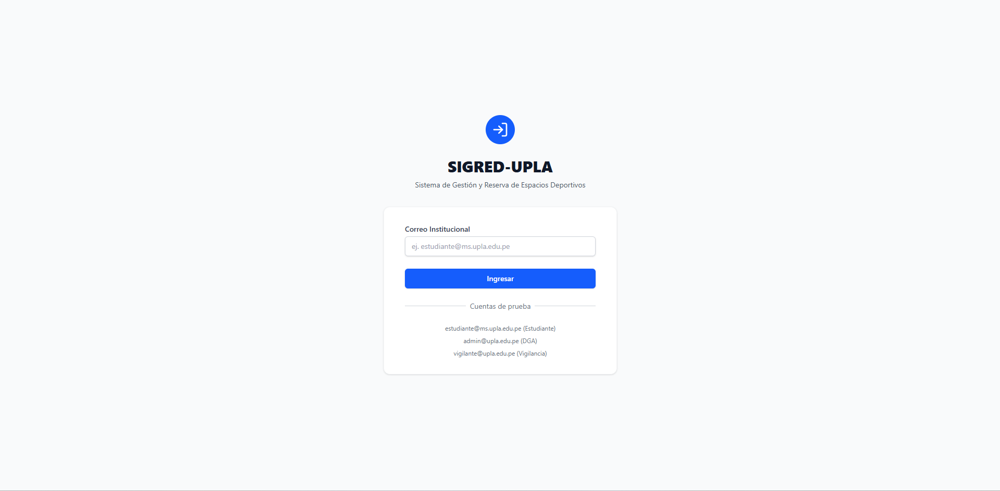
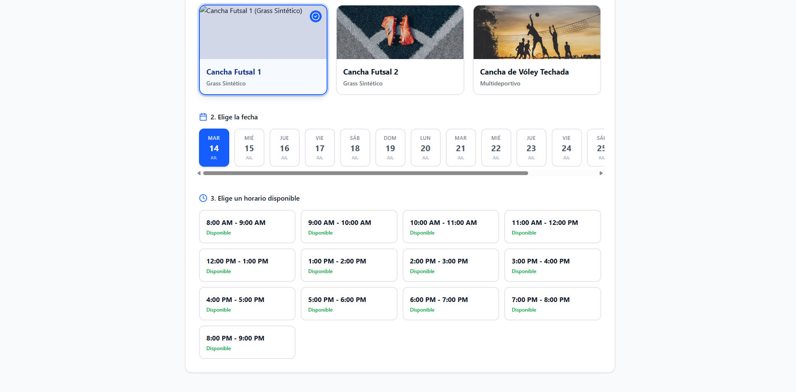

[⬅️ Volver al menú principal](../../README.md)

---
# Sprint 1: Cimientos (Autenticación y Calendario)

**Objetivo del Sprint:** Desplegar la estructura base del proyecto SIGRED-UPLA y garantizar que los estudiantes puedan autenticarse y visualizar los horarios disponibles.

### 📊 Historias de Usuario Completadas
* **HU-01 (3 Pts):** Como estudiante, quiero iniciar sesión con correo `@upla.edu.pe`.
* **HU-02 (5 Pts):** Como solicitante, quiero ver el calendario para conocer disponibilidad.

### 💻 Detalles Técnicos y Desarrollo
* Se configuró el entorno de base de datos MySQL local para desarrollo. Por directiva de seguridad interna del equipo, el entorno de pruebas fue configurado estrictamente sin contraseña en el acceso root local para agilizar las pruebas de integración.
* La personalización visual del calendario interactivo se realizó exclusivamente mediante modificaciones en las hojas de estilo (CSS), manteniendo intactos los scripts (JS) base del componente para asegurar su mantenibilidad.

### 📸 Evidencia Visual
*A continuación se muestra la interfaz de inicio de sesión institucional:*

*Calendario de disponibilidad de canchas:*

### 🛡️ Calidad y Control
* Aplicación de **Shift-Left**: Se realizaron pruebas de usabilidad del calendario en Figma antes de programar[cite: 2].
