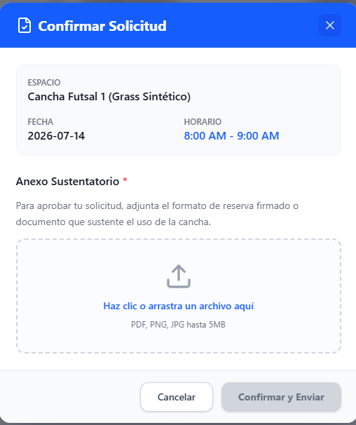

[⬅️ Volver al Cronograma](Cronograma.md) | [🏠 Menú Principal](../../README.md)

---
# Sprint 2: Motor Transaccional (Reservas)

**Objetivo del Sprint:** Permitir a los usuarios generar solicitudes formales de reserva subiendo su anexo documental.

### 📊 Historias de Usuario Completadas
* **HU-03 (8 Pts):** Como estudiante, quiero llenar un formulario y adjuntar PDF.
* **HU-04 (3 Pts):** Como solicitante, quiero cancelar mi reserva anticipadamente.

### 💻 Detalles Técnicos y Desarrollo
* Integración de almacenamiento de archivos para los anexos (PDF/JPG) con un límite estricto de 5MB.
* Lógica de base de datos implementada para prevenir la cancelación si faltan menos de 2 horas para el evento.

### 📸 Evidencia Visual
*Formulario de solicitud de reserva:*

### 🛡️ Calidad y Control
* **Revisión por Pares (Peer Review):** Todo el código del formulario de carga de archivos fue revisado conjuntamente por Javier y José para evitar vulnerabilidades de seguridad[cite: 2].
