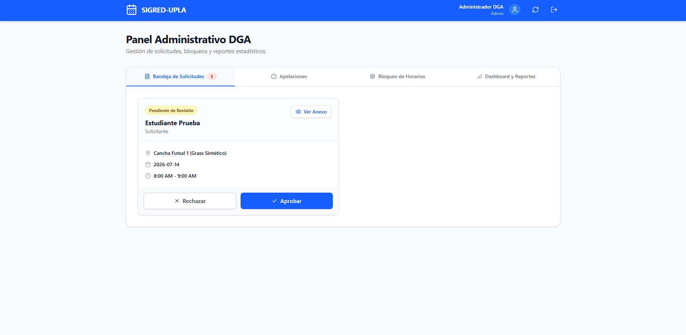

[⬅️ Volver al Cronograma](Cronograma.md) | [🏠 Menú Principal](../../README.md)

---
# Sprint 3: Administración DGA

**Objetivo del Sprint:** Entregar el panel de control a la Dirección General de Administración para la gestión del flujo de aprobaciones.

### 📊 Historias de Usuario Completadas
* **HU-05 (5 Pts):** Como DGA, quiero ver solicitudes pendientes para aprobar/rechazar.
* **HU-06 (5 Pts):** Como DGA, quiero configurar horarios fijos (clases).

### 💻 Detalles Técnicos y Desarrollo
* Creación del panel de administración (Dashboard) protegido por control de acceso basado en roles (RBAC).
* Desarrollo del algoritmo que bloquea automáticamente los "Horarios Fijos" en el calendario público de los estudiantes.

### 📸 Evidencia Visual
*Panel de Aprobación DGA:*

### 🛡️ Calidad y Control
* **Demostración UAT:** Al finalizar el Sprint, Diego (Proxy PO) validó las reglas de negocio directamente con la interfaz, asegurando la satisfacción del cliente[cite: 2].
