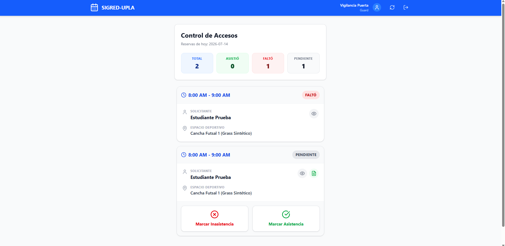
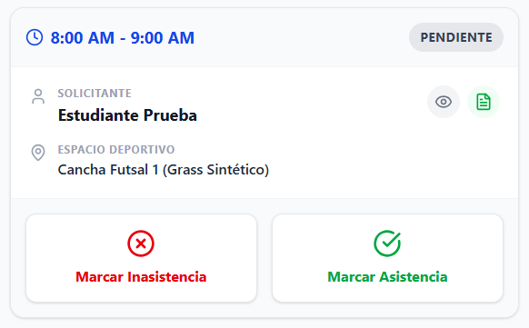

[⬅️ Volver al Cronograma](Cronograma.md) | [🏠 Menú Principal](../../README.md)

---
# Sprint 4: Interfaz de Vigilancia

**Objetivo del Sprint:** Proveer al personal de seguridad una herramienta móvil rápida para validar identidades y registrar la asistencia en tiempo real.

### 📊 Historias de Usuario Completadas
* **HU-07 (5 Pts):** Como vigilante, quiero ver reservas del día en celular.
* **HU-08 (3 Pts):** Como vigilante, quiero registrar asistencia exacta (Asistió/No Asistió).

### 💻 Detalles Técnicos y Desarrollo
* Diseño de interfaz bajo el patrón *Mobile-First*. Botones sobredimensionados (mínimo 44x44px) para facilitar la interacción táctil al aire libre.
* Ajustes de diseño responsivo aplicados directamente en las hojas de estilo (CSS) sin alterar la lógica de los scripts base.

### 📸 Evidencia Visual
*Vista móvil para el vigilante:*

*Control de Asistencia (Check-in):*

### 🛡️ Calidad y Control
* **Pruebas de Usabilidad:** Se testeó la interfaz con la pantalla bajo luz solar directa para garantizar alto contraste.
