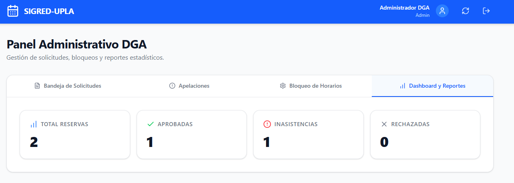
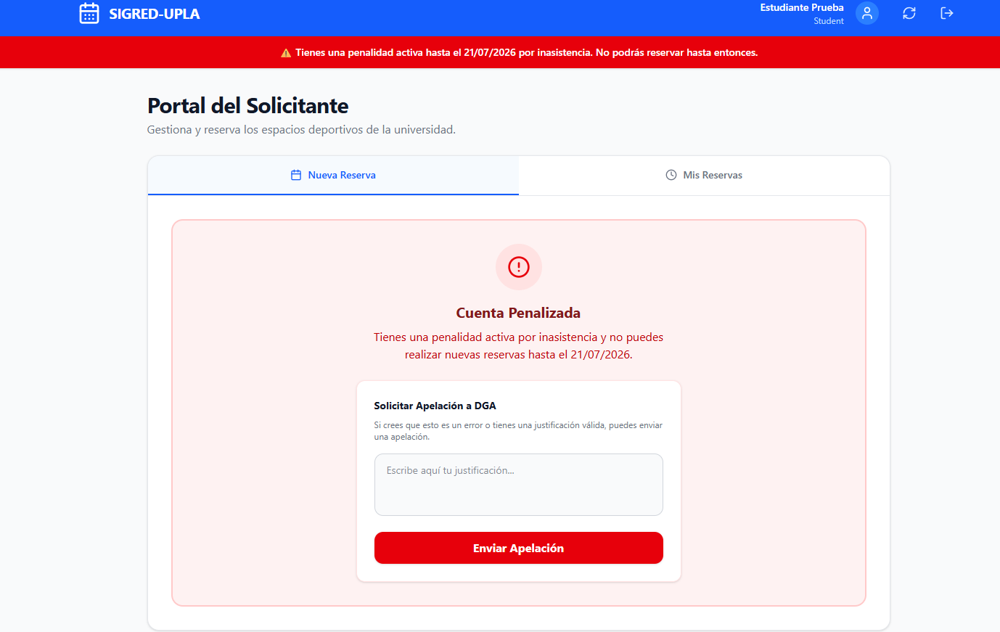

[⬅️ Volver al Cronograma](Cronograma.md) | [🏠 Menú Principal](../../README.md)

---
# Sprint 5: Lógica de Negocio y Métricas

**Objetivo del Sprint:** Automatizar las reglas de negocio críticas de la universidad (penalidades) y dotar a la DGA de herramientas analíticas para la toma de decisiones.

### 📊 Historias de Usuario Completadas
* **HU-09 (8 Pts):** Como sistema, quiero bloquear a los ausentes para penalizar reservas fantasma.
* **HU-10 (5 Pts):** Como DGA, quiero visualizar un dashboard estadístico.

### 💻 Detalles Técnicos y Desarrollo
* Desarrollo de un *Job* programado en el backend que escanea inasistencias y cambia el estado del usuario a "Bloqueado" por 7 días calendario.
* Implementación de gráficos (Chart.js / Recharts) para mostrar horas pico de uso y porcentaje de inasistencias.

### 📸 Evidencia Visual
*Dashboard Estadístico de la DGA:*

*Alerta de Usuario Penalizado:*

### 🛡️ Calidad y Control
* **Análisis de Código Estático:** Implementación de SonarCloud para evaluar la complejidad ciclomática del algoritmo de penalidades[cite: 3].
